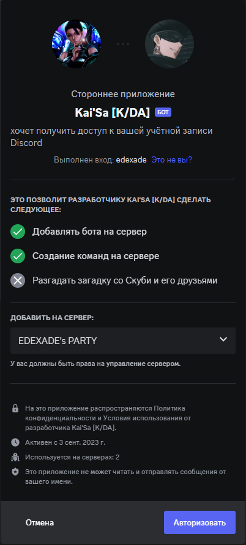
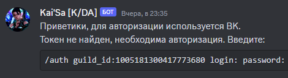
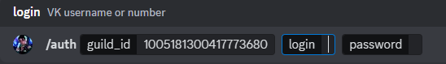
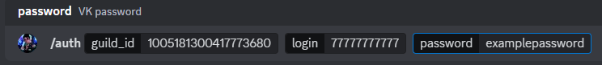
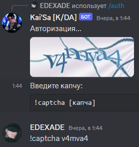
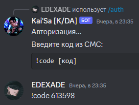
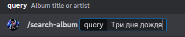
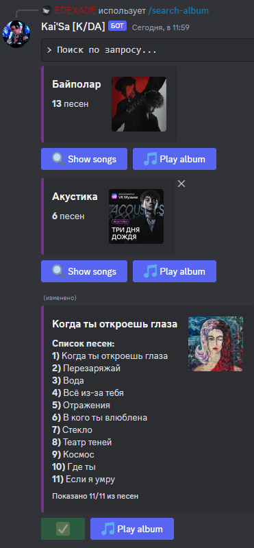
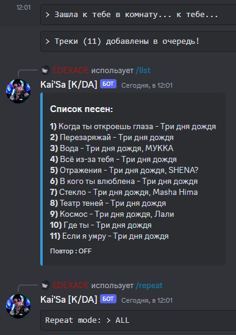

# Kai'Sa [K/DA]
## Содержание:
0. [Пригласить бота на сервер](https://discord.com/api/oauth2/authorize?client_id=1147834135918956577&permissions=2150664192&scope=bot%20applications.commands)
1. [Вступление](#intro)
2. [Начало работы](#start)
3. [Команды бота](#commands)
4. [Задачи](#tasks)
5. [Зависимости](#requirements)

## 🎵 Добро пожаловать в мир музыки с "Кайсой из К/DA"! 🎵 

🎧 Познакомьтесь с вашим новым музыкальным спутником, который перенесет вас в мир магии и музыки, как это делают Кайсы из K/DA! Наш бот - это не просто музыкальный бот, это настоящий артист, создающий уникальную атмосферу на вашем сервере Discord.

✨ Почему выбрать именно нас:
- 🎶 Бескрайний музыкальный опыт: Наш бот предоставляет доступ к миллионам треков самых разных жанров. От хип-хопа до классики, от K-Pop до рок-н-ролла - у нас есть всё!
- 🤖 Интуитивный интерфейс управления: Наш бот прост в использовании, даже если вы новичок в Discord. Управление музыкой - это легко!
- 🎵 Собственные плейлисты: Создавайте свои собственные музыкальные плейлисты и делитесь ими с друзьями!
- 🌟 Поддержка текстовых и голосовых команд: Вы можете управлять музыкой, даже не выходя из голосового чата!

🎉 Присоединяйтесь к нам и окунитесь в мир музыки и развлечений, напоминающий невероятные выступления Кайсы из K/DA на большой сцене! Наслаждайтесь звуками и создавайте незабываемые моменты на своем сервере Discord с музыкальным ботом "Кайса из К/DA"! 🎶💃🎤

Не упустите шанс добавить этого бота на свой сервер и создать уникальную атмосферу для ваших друзей и сообщества! 🚀🎵

## Начало работы (пример от партнёра) 

### 1. Пригласите бота [<b>по ссылке</b>](https://discord.com/api/oauth2/authorize?client_id=1147834135918956577&permissions=2150664192&scope=bot%20applications.commands).

### 2. Пропишите `/register`. 
**Внимание!** Сообщение должно быть отправлено админом гильдии/сервера

### 3. Перейдите в лс с ботом.

### 4. Скопируйте строку и вставьте в поле ввода. Если текст не превратился сразу в команду - просто нажмите Enter.

### 5. Введите <i>Телефон</i>, <i>Пароль</i> и нажмите Enter.

### 6. При необходимости введите код двухфакторной авторизации или капчи.

### 7. Если всё успешно - сервис готов. Иначе заново вернитесь к **Пункту 4**

### 8. Используйте команды ниже для использования сервиса. Примеры результатов:

`/search-album` Три дня дождя

`/list`

`/repeat ALL`

## Команды 
<table>
  <tr>
    <td><b>Команды управления ботом</b></td>
    <td><b>Команды управления аккаунтом пользователя</b></td>
  </tr>
  <tr>
    <td>✅ /ping</td>
    <td>✅ /register</td>
  </tr>
  <tr>
    <td>⌛ /help</td>
    <td>✅ /unregister</td>
  </tr>
  <tr>
    <td>✅ /report</td>
    <td>✅ /auth [id гильдии] [логин/телефон] [пароль]</td>
  </tr>
</table>

<table>
  <tr>
    <td><b>Команды поиска и воспроизведения музыки</b></td>
    <td><b>Команды управления воспроизведением музыки</b></td>
  </tr>
  <tr>
    <td>✅ /search [название/автор песни]</td>
    <td>✅ /list</td>
  </tr>
  <tr>
    <td>✅ /search-album [название плейлиста (исполнителя)]</td>
    <td>✅ /repeat [OFF | ONE | ALL]</td>
  </tr>
  <tr>
    <td>✅ /search-playlist [название плейлиста (пользователя)]</td>
    <td>✅ /skip</td>
  </tr>
  <tr>
    <td>⌛ Soon...</td>
    <td>✅ /quit</td>
  </tr>
</table>

## Задачи: 
### Общее:
- ✅ Воспроизведение и интерактивность с голосовыми каналами
- ✅ Интеграция `vkpymusic` для доступа к аудио и плейлистам
- ✅ Работа с аудио
- ✅ СКАЧИВАНИЕ!!!
- ✅ Работа с плейлистами

### Очередь треков:
- ✅ Своя очередь для каждой группы
- ✅ Очередь треков (синхронная)
- ❌ Очередь асинхронная (с использованием `asyncio.Queue` или иначе)

### Токены VK API:
- ✅ Сохранение API токенов для каждой гильдии/сервера
- ✅ Автоматическое переподключение сервиса вместо /register
- ❌ Проверка валидности API токена

### Прочее:
- ⌛ Редизайн и правки
- ⌛ Документация и комментарии к коду
- ⌛ Тестирование и отладка

### Возможное и невозможное:
- ❌ Дополнительные функции для управления плейлистами
- ❌ Интеграция с другими музыкальными сервисами
- ❌ Работоспособность на 100%

## Зависимости 
Для работы проекта требуется установить следующие зависимости:

- `aiohttp`: библиотека для работы с запросами/установками.
- `discord.py`: библиотека для работы с Discord API.
- `discord.py[Voice]`: библиотека для работы с голосовыми каналами Discord.
- `PyNaCl`: библиотека для воспроизведения аудио.
- `vkpymusic`: моя собственная библиотека для работы с музыкой в ВКонтакте.
- `ffmpeg`: утилита для работы с аудио-потоками.
